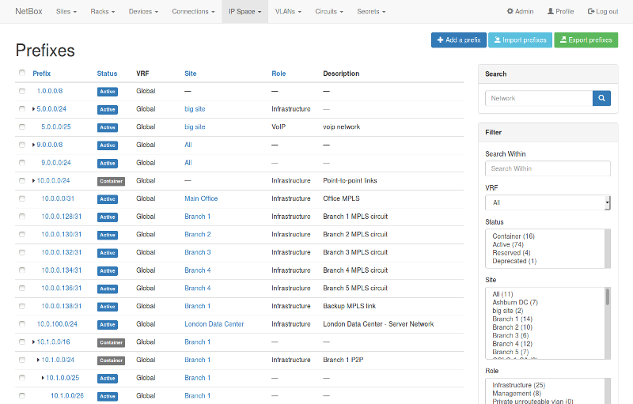

NetBox is an IP address management (IPAM) and data center infrastructure management (DCIM) tool. Initially conceived by the network engineering team at [DigitalOcean](https://www.digitalocean.com/), NetBox was developed specifically to address the needs of network and infrastructure engineers.

NetBox runs as a web application atop the [Django](https://www.djangoproject.com/) Python framework with a [PostgreSQL](http://www.postgresql.org/) database. For a complete list of requirements, see `requirements.txt`. The code is available [on GitHub](https://github.com/digitalocean/netbox).

# Installation

Please see docs/getting-started.md for instructions on installing NetBox.

# Components

NetBox understands all of the physical and logical building blocks that comprise network infrastructure, and the manners in which they are all related.

## DCIM

DCIM comprises all the physical installations and connections which comprise a network. NetBox tracks where devices are installed, as well as their individual power, console, and network connections.

**Site:** A physical location (typically a building) where network devices are installed. Devices in different sites cannot be directly connected to one another.

**Rack:** An equipment rack into which devices are installed. Each rack belongs to a site.

**Device:** Any type of rack-mounted device. For example, routers, switches, servers, console servers, PDUs, etc. 0U (non-rack-mounted) devices are supported.

## IPAM

IPAM deals with the IP addressing and VLANs in use on a network. NetBox makes a distinction between IP prefixes (networks) and individual IP addresses.

Because NetBox is a combined DCIM/IPAM system, IP addresses can be assigned to device interfaces in the application just as they are in the real world.

**Aggregate:** A top-level aggregate of IP address space; for example, 10.0.0.0/8 or 2001:db8::/32. Each aggregate belongs to a regional Internet registry (RIR) like ARIN or RIPE, or to an authoritative standard such as RFC 1918.

**VRF:** A virtual routing table. VRF support is currently still under development.

**Prefix:** An IPv4 or IPv6 network. A prefix can be assigned to a VRF; if not, it is considered to belong to the global table. Prefixes are grouped by aggregates automatically and can optionally be assigned to sites.

**IP Address:** An individual IPv4 or IPv6 address (with CIDR mask). IP address can be assigned to device interfaces.

**VLAN:** VLANs are assigned to sites, and can optionally have one or more IP prefixes assigned to them. VLAN IDs are unique only within the scope of a site.

## Circuits

Long-distance data connections are typically referred to as _circuits_. NetBox provides a method for managing circuits and their providers. Individual circuits can be terminated to device interfaces.

**Provider:** An entity to which a network connects to. This can be a transit provider, peer, or some other organization.

**Circuit:** A data circuit which connects to a provider. The local end of a circuit can be assigned to a device interface.

## Secrets

NetBox provides encrypted storage of sensitive data it calls _secrets_. Each user may be issued an encryption key with which stored secrets can be retrieved.

Note that NetBox does not merely hash secrets, a function which is only useful for validation. It employs fully reversible AES-256 encryption so that secret data can be retrieved and consumed by other services.

**Secrets** Any piece of confidential data which must be retrievable. For example: passwords, SNMP communities, RADIUS shared secrets, etc.

**User Key:** An individual user's encrypted copy of the master key, which can be used to retrieve secret data.
